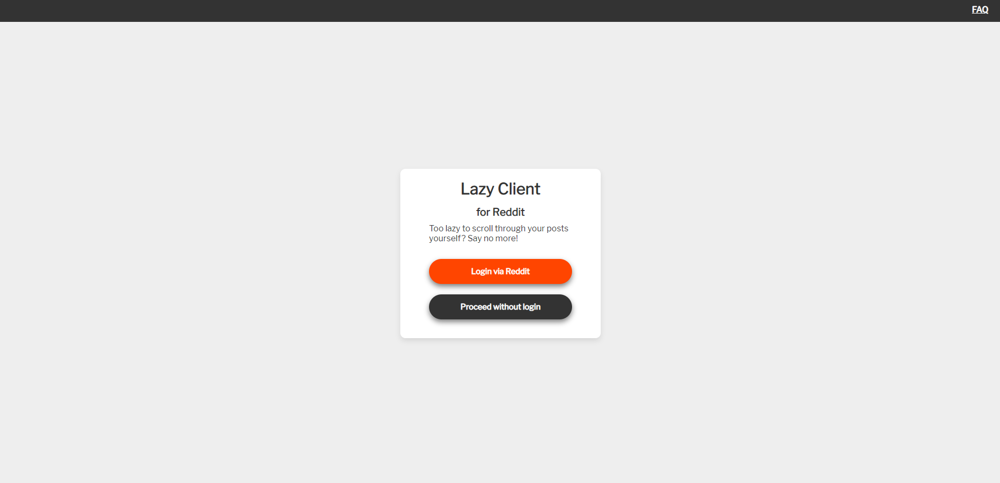
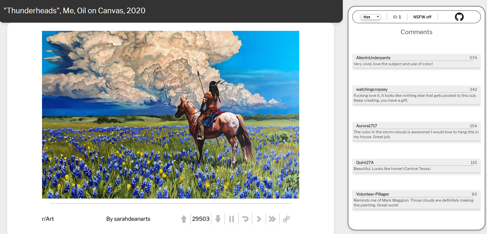

# Lazy Reddit

This is a React app that allows you to browse Reddit hands-free. It has a couple of nice-to-haves, such as upvoting/downvoting, pausing the timer, skipping the current post, and skipping a batch of posts. It is not meant to substitute Reddit itself, and if you find yoursels interacting with it much, then you are probably better using the official reddit website instead.

## How does it work?

You authenticate via Reddit (or you could go userless if you like browsing r/all and don't care about upvoting/downvoting). Then the posts will load, and keep switching every 10 seconds. It also displays some comments, and there are some control buttons, such as sorting by hot, new, rising, top, best; NSFW toggle (of course), skipping, pausing, going back, and linking to the actual Reddit post.

## Why?

I was bored one day, thinking how nice it could be if I could do something on the main monitor, while Reddit feed would just scroll itself for me (and I really wanted to learn React).

## Downsides?
It is kind of slow if you are using it interactively a lot, since it is waiting for all the fetching requests to be complete before updating the UI. The UI is also rough, but it is the content that matters (my excuse).

## Tech used
* React
* snoowrap.js
* Deployed on Netlify (Hosted at https://www.lazyclientfr.com)

## Screenshots

Login page

The actual app